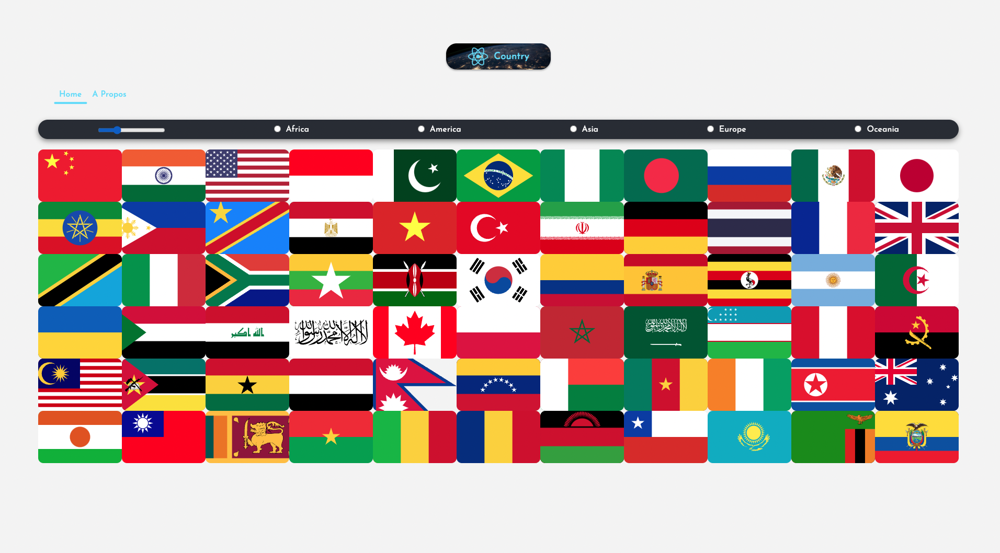

# Projet d'Application des Pays du Monde en React

Ce projet est une application interactive des pays du monde, créée en utilisant React et en se basant sur l'API [Rest Countries](https://restcountries.com). L'objectif de cette application est de permettre aux utilisateurs de rechercher et d'afficher des informations détaillées sur différents pays, telles que leur drapeau, leur capitale, leur population, leur langue et bien plus encore.

## Fonctionnalités Principales

- **Exploration Facilitée :** L'application permet aux utilisateurs de rechercher des pays par leur nom ou de parcourir la liste complète des pays du monde.

- **Détails des Pays :** Chaque pays affiche des informations importantes telles que la population, la superficie, la monnaie utilisée, les langues parlées et bien d'autres détails.

- **Affichage des Drapeaux :** L'application utilise l'API Rest Countries pour afficher les drapeaux officiels de chaque pays.

- **Tri et Filtrage :** Les utilisateurs peuvent trier les pays par nom, population, superficie, etc., et appliquer des filtres pour afficher uniquement les pays répondant à certaines conditions.

## Capture d'Écran

## Mise en Route

1. Clonez ce dépôt sur votre machine locale.
2. Installez les dépendances en utilisant la commande `yarn install`.
3. Lancez l'application avec `yarn start`.

## Ressources Utilisées

- [API Rest Countries](https://restcountries.com) pour les données sur les pays du monde.
- [React](https://reactjs.org/) pour la construction de l'interface utilisateur interactive.

## Contributions

Les contributions sont les bienvenues ! Si vous souhaitez ajouter des fonctionnalités, corriger des bugs ou améliorer l'expérience utilisateur, n'hésitez pas à soumettre une demande d'extraction.

---

Ce projet a été inspiré par une vidéo tutorielle de [FromScratch - Le développement Web de zéro](https://www.youtube.com/channel/UCFbNIlppjAuEX4znoulh0Cw) et a été créé par [CAZIMIRA Ambro](https://github.com/Ambrosioc) . Il illustre comment créer une application de recherche de pays du monde en utilisant React et l'API Rest Countries.
